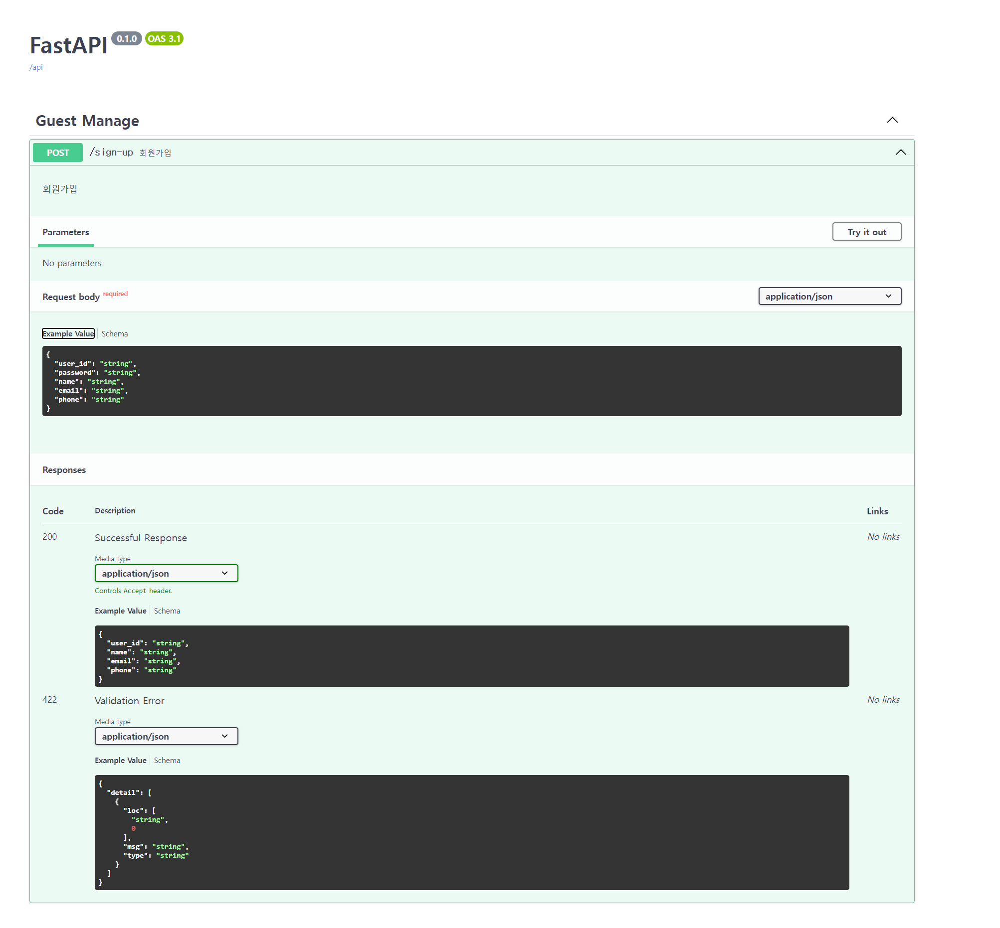
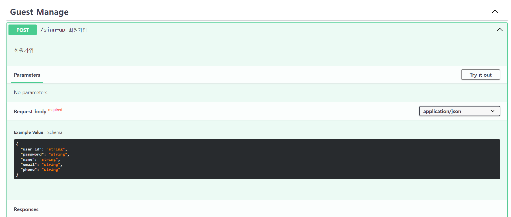

## Intro
안녕하세요 **Noah**입니다.<br/>
민족의 명절 설날이 밝았습니다. 다들 올 한해 복 많이 받으시길 바라겠습니다.<br/>
오늘은 FastAPI 사용 시 Swagger 설정을 하는 방법에 대해 알아보겠습니다.
<br/><br/><br/><br/>

## 본문
FastAPI는 API명세(Swagger, Redoc) UI를 자동으로 생성해주는 강력한 API 프레임워크입니다.

### 기본 설정
1. FastAPI 모듈을 임포트합니다.
2. FastAPI 인스턴스를 생성합니다.
3. docs_url 및 redoc_url 매개변수를 사용하여 원하는 API명세서 URL을 지정합니다.
```Python
from fastapi import FastAPI

app = FastAPI(
    openapi_url="/api", # 실제 API URL
    docs_url="/docs", # Swagger UI URL
    redoc_url="/redoc", # ReDoc URL
)
```
4. 생성한 router를 app.include_router()를 통해 등록합니다.
   * router.py
    ```Python
    from fastapi import APIRouter, Depends
    from sqlalchemy.orm import Session
    
    from src.api.guest.response_dto import SignUpResponseDto
    from src.api.guest.request_dto import SignUpRequestDto
    from src.api.guest import service as guest_service
    from src.core.database.database import get_db
    from src.core.common.dto import ResponseDTO
    
    router = APIRouter(
    tags=["Guest Manage"],
    )
    
    # 회원가입 관련 정보를 router 내에 입력하여 API 명세 시 활용
    @router.post("/sign-up", response_model=SignUpResponseDto, summary="회원가입", description="회원가입")
    async def sign_up(request_dto: SignUpRequestDto, db: Session = Depends(get_db)): # Depends를 통해 입력되는 내용은 API 명세에 표시되지 않음
        response = guest_service.sign_up(request_dto, db)
        db.commit()
        response["hashed_password"] = None
        return ResponseDTO().of(response)
    ```
   
    * main.py
    ```Python
    from fastapi import FastAPI
    from src.api.guest.router import router as guest_router
   
    app = FastAPI(
        openapi_url="/api", # 실제 API URL
        docs_url="/docs", # Swagger UI URL
        redoc_url="/redoc", # ReDoc URL
    )
   
    app.include_router(guest_router)
    ```
   
    * request_dto.py
    ```Python
    from pydantic import BaseModel
    from typing import Optional
   
    class SignUpRequestDto(BaseModel):
        user_id: str
        password: str
        name: str
        email: str
        phone: Optional[str]=None # Optional을 통해 null을 허용할 것인지 명세하고, None을 통해 필수값 여부를 설정할 수 있음
    ```
   
    * response_dto.py
    ```Python
    from pydantic import BaseModel
    from typing import Optional
   
    class SignUpResponseDto(BaseModel):
        user_id: str
        name: str
        email: str
        phone: Optional[str]
    ```
parameter를 설정할 때 'Optional'을 통해 null을 허용할 것인지 명세하고, '=None'을 통해 필수값(required) 여부를 설정할 수 있습니다. 'request_dto.py' 코드부분을 확인하세요.
<br/><br/>

### API 명세 확인
#### 1. Swagger
docs_url은 기본적으로 base url + /docs로 설정됩니다. 우리가 흔히 아는 Swagger 문서 형식을 제공합니다.<br/>
schema를 통해 필수값에 대한 명세를 확인할 수 있습니다.<br/>
<br/>

<br/><br/><br/><br/>

#### 2. Redoc
redoc_url은 기본적으로 base url + /redoc로 설정됩니다.<br/>
개인적으론 Open API를 만들어 외부 사람들에게 제공할 때 사용하기 좋은 문서 형식이라고 생각됩니다. 여기서는 테스트하기에는 불편하나 한 눈에 어떤 파라미터들이 필수값인지 어떤 응답결과가 나오는지 확인하기에는 좋습니다.<br/>

<br/><br/>

### 추가 설정
저는 잘 사용하진 않지만 Swagger UI 테마 변경도 가능합니다.<br/>
swagger_ui_parameters 매개변수를 사용하여 테마를 설정할 수 있습니다.
```Python
app = FastAPI(
   openapi_url="/api", # 실제 API URL
   docs_url="/docs", # Swagger UI URL
   redoc_url="/redoc", # ReDoc URL
   swagger_ui_parameters={"syntaxHighlight.theme": "obsidian"}, # 테마 설정 - 글씨 색상 변경
)
```
글색이 변경된 모습 확인 가능<br/>

<br/><br/><br/><br/>

## 글을 마치며
오늘은 FastAPI에서 Swagger와 Redoc을 설정하는 방법에 대해 살펴보았습니다. API 명세는 API 개발 및 사용에 있어 중요한 역할을 합니다.<br/>
API 명세는 개발자 효율성을 향상시키고 일관성 및 표준화를 보장합니다. 뿐만 아니라 에러 및 문제 해결을 돕고, 보안 및 테스트를 강화하는 곳에 사용되기도 합니다.<br/>
여러분들도 명확한 API 명세를 통해 효율적인 개발을 진행하시길 바랍니다. 감사합니다.
<br/><br/>

[참고자료]
* [FastAPI 공식 문서](https://fastapi.tiangolo.com/ko/)
* [OpenAPI 스펙](https://swagger.io/specification/)
* [Swagger UI](https://swagger.io/tools/swagger-ui/)
* [ReDoc](https://redocly.github.io/redoc/)