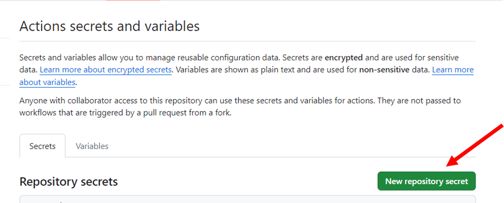
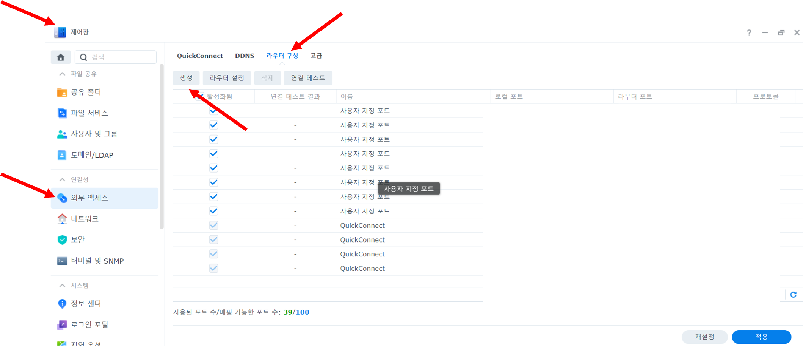
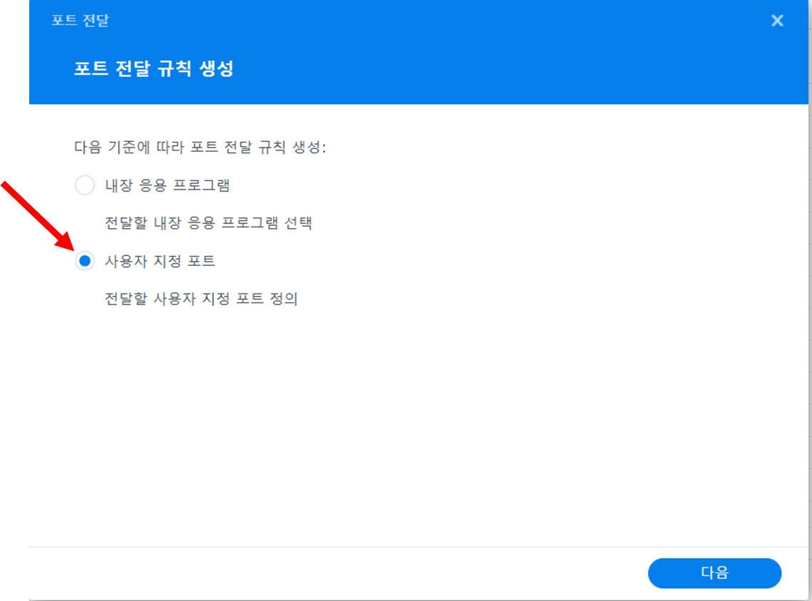
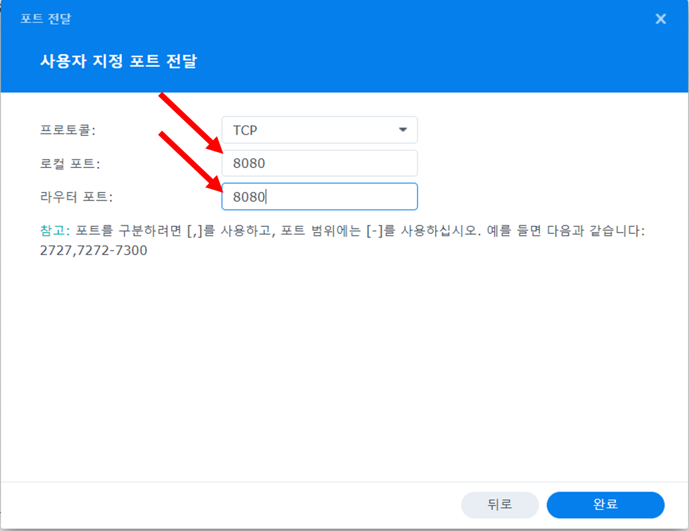

## Intro
안녕하세요 **Noah**입니다

오늘은 제가 최근에 진행한 프로젝트 중 하나인 Synology NAS에 Github Action을 이용한 CI/CD(자동배포) 구축에 대해 공유하고자 합니다.<br/>
3번정도 시도했다가 포기하고 마지막으로 해보잔 심정으로 도전했다가 성공한 내용이라 더욱 뿌듯하게 느껴지는 것 같습니다.<br/>

목차는 아래와 같습니다. ^^<br/>
- [1. NAS 내 Docker 설치](#1-nas-내-docker-설치)
- [2. NAS 내 Key 발급](#2-nas-내-key발급)
- [3. Repository 내 Docker Action Script 작성](#3-repository-내-docker-action-script-작성)
- [4. Repository 내 Secret Key 입력](#4-repository-내-secret-key-입력)
- [5. Dockerfile 작성](#5-dockerfile-작성)
- [6. Dockerfile 배포 확인](#6-dockerfile-배포-확인)
- [7. Port Open](#7-port-open)
- [8. 서버 오픈 확인](#8-서버-오픈-확인)


## 본문
### 1. NAS 내 Docker 설치
* 다양한 인터넷 예시가 존재하니 확인하시고 먼저 Docker부터 NAS에 설치해주시면 됩니다.<br/>
예시) [Synology NAS에 Docker 설치하는 방법](https://www.lainyzine.com/ko/article/how-to-install-and-use-docker-on-your-synology-nas/)

* 설치 CLI로 NAS에 접속해 docker 설치 여부 확인<br/>
    ```bash
    docker --version
    ```

    
<br/><br/><br/>

### 2. NAS 내 Key발급
1. 계정의 root 디렉토리에 .ssh 폴더 내 Key 파일 생성<br/>
    ```bash
    ssh-keygen
    ```
   
    
<br/><br/><br/>

### 3. Repository 내 Docker Action Script 작성
##### Repository 내 .github/workflows 폴더 생성
* 디렉토리 경로<br/>
  

##### 해당 폴더 내 .yml 파일 생성
* 어떤 branches가 변경될 때 해당 Action을 실행할 것인지, 어떤 환경변수를 사용할 것인지 등을 정의합니다.
* 여기서 SSH 연결하는 부분을 집중해서 봐주세요. 저는 여러 시도 끝에 이 부분을 해결하는 데에 많은 시간을 소비했었습니다. ㅠㅠ
* "Build and Deploy Docker Image" 이 부분은 본인의 환경에 맞게 수정해주시면 됩니다. 저는 혹시 모를 상황을 대비해 배포 시 마다 폴더 자체를 삭제하고 다시 생성하도록 설정했습니다.
  * 이 부분은 본인의 환경에 맞게 수정하셔야 합니다.
* 예시 코드<br/>
    ```bash
    name: Deploy to NAS Server
    
    on:
    push:
    branches: [ "dev" ]
    
    env:
    REGISTRY: ghcr.io
    IMAGE_NAME: ${{ github.repository }}
    
    jobs:
    deploy:
    runs-on: ubuntu-latest
    steps:
    - name: Checkout code
    uses: actions/checkout@v2
    
          - name: Set up SSH connection
            uses: webfactory/ssh-agent@v0.5.3
            with:
              ssh-private-key: ${{ secrets.SSH_PRIVATE_KEY }}
    
          - name: Build and Deploy Docker Image
            run: |
              ssh -o StrictHostKeyChecking=no ${{ secrets.SSH_USERNAME }}@${{ secrets.SSH_IP }} -p ${{ secrets.SSH_PORT }} << 'EOF'
                cd /volume1/web/APP_PATH
                rm -rf SERVER_NAME
                mkdir SERVER_NAME
                git clone -b dev --single-branch https://${{ secrets.GIT_USERNAME }}:${{ secrets.GIT_PASSWORD }}@github.com/SERVER_NAME.git
                cd SERVER_NAME
                docker stop SERVER_DOCKER_IMG_NAME || true
                docker rm SERVER_DOCKER_IMG_NAME || true
                sleep 30
                docker build -t SERVER_DOCKER_IMG_NAME:latest -f dev.Dockerfile . && \
                docker run -d --name SERVER_DOCKER_IMG_NAME -e SPRING_PROFILES_ACTIVE=dev -e SPRING_DATASOURCE_PASSWORD=${{ secrets.SPRING_DATASOURCE_DEV_PASSWORD }} -e JWT_SECRET=${{ secrets.JWT_DEV_SECRET }} -p 8080:8080 SERVER_DOCKER_IMG_NAME:latest
              EOF
    ```

##### 파일 배포 전 확인 사항
1. SSH_USERNAME으로 등록된 유저에게 폴더 관리 및 docker 명령어 실행 권한이 있는지 확인이 필요합니다.
2. GIT_PASSWORD는 Token으로 발급받아 사용해야 합니다.
3. SSH_PRIVATE_KEY는 NAS에서 만든 Private Key를 사용해야 합니다.(위 코드에선 Public Key로는 인증이 불가합니다.)
<br/><br/><br/>

### 4. Repository 내 Secret Key 입력
* 위 YML 파일에서 중괄호에 담아 사용한 환경변수들(ex- ${{ secrets.GIT_USERNAME }})은 Repository 내 Action용 Secret Key를 등록하여 사용합니다.<br/>이를 통해 중요 KEY들이 외부로 노출되는 것을 막을 수 있습니다.
* 등록 방법<br/>
  

  
<br/><br/><br/>

### 5. Dockerfile 작성
* 본인 환경에 맞게 Dockerfile을 작성합니다. 이 때 Dockerfile용 폴더를 구분하실 거면 위 YML 파일에서 해당 폴더로 이동하는 부분을 수정해주셔야 합니다.
* 아래는 Dockerfile 예시 코드입니다.<br/>
    ```bash
    # 베이스 이미지로 OpenJDK 17을 사용
    FROM openjdk:17-slim as build
    
    # Gradle 래퍼를 사용하기 위한 준비
    WORKDIR /app
    COPY gradlew .
    COPY gradle gradle
    COPY build.gradle .
    COPY settings.gradle .
    COPY src src
    
    # gradlew에 실행 권한 부여(이 부분을 제거하면 권한 부족으로 Build 불가)
    RUN chmod +x ./gradlew
    
    # 애플리케이션 빌드
    RUN ./gradlew build -x test
    
    # 빌드 결과물을 실행할 새로운 스테이지
    FROM openjdk:17-slim
    WORKDIR /app
    COPY --from=build /app/build/libs/APP_NAME.jar APP_NAME.jar
    
    # docker run 시 선언했던 환경 변수를 사용하여 애플리케이션 실행
    ENTRYPOINT java -jar app.jar -Dspring.profiles.active=${SPRING_PROFILES_ACTIVE} -Dspring.datasource.password=${SPRING_DATASOURCE_PASSWORD} -Djwt.secret=${JWT_SECRET}
    ```

### 6. Dockerfile 배포 확인
##### Github Console에서 Action 확인
* Github Action으로 접근해 해당 Action이 정상적으로 동작하는지 확인합니다. 이 때 SSH 권한 관련해서 문제가 발생할 수 있으니 이 부분을 반드시 확인해야 합니다.
* 각 권한 설정은 NAS마다 다르기 때문에 각자가 해결하셔야 하는 부분이라 이 부분은 생략하겠습니다. 다만 체크해보셔야 할 부분들을 조금 정리해보겠습니다.
  1. SSH 접속 유저에게 각종 명령어에 대한 권한이 있는지 확인<br/>
     배포 시 문제 해결을 위해 저는 ROOT 권한으로 설정했을 때도 되는지, 안되는지 체크하면서 권한을 하나씩 설정했습니다.<br/>
     안된다고 포기하지 마시고 우선 Root권한으로 설정해서 확인해보시고 되면 해당 유저에게 필요한 권한을 부여하시면 됩니다. 화이팅!
  2. 생성했던 Private Key가 정상적으로 맵핑되었는지 확인<br/>
     Private Key가 정상적인데도 SSH 연결 시 오류가 있다면 NAS에서 해당 키를 인식하지 못할 수 있습니다. 관련 내용을 잘 확인해보세요!!
* 최종적으로 아래처럼 성공이 돼야합니다.<br/>
  

##### NAS에서 Docker 실행 확인
* 위에서 정상적으로 동작했다면 NAS에서 해당 Docker Container가 실행되는지 확인합니다.

```bash
# 실행 중인 컨테이너 목록 확인
docker ps
```


### 7. Port Open
* 해당 서버의 포트를 열어주어야 외부에서 접속이 가능합니다.
* 다음은 Synology NAS에서 포트를 열어주는 방법입니다.








<br/><br/><br/>

### 8. 서버 오픈 확인
* 모든 작업을 완료하셨다면 지정한 포트로 정상 작동하는지 확인해주시면 되겠습니다.


<br/><br/><br/><br/>

## 글을 마치며
오늘 소개해드린 Synology NAS와 Github Action을 이용한 CI/CD 구축 방법을 통해, 여러분도 자동화된 배포 과정을 경험해보실 수 있을 것입니다. 이 글이 도전적인 프로젝트에 직면하거나, 효율적인 개발 환경을 모색하는 분들께 도움이 되었기를 바랍니다.

실제로 구축 과정에는 여러 난관이 있었지만, 그만큼 성공했을 때의 성취감은 이루 말할 수 없었습니다. 이러한 경험을 통해 기술의 끝은 정말로 무궁무진하다는 것을 다시 한번 깨달았습니다.

앞으로도 개발과 관련된 다양한 지식과 경험을 공유할 예정이니, 관심 있으신 분들은 자주 방문해 주세요. 또한, 이 포스트를 통해 생긴 궁금증이나 추가적으로 알고 싶은 내용이 있다면 언제든지 댓글로 남겨주세요. 여러분의 피드백은 제가 더 나은 콘텐츠를 만드는 데 큰 도움이 됩니다.

이 글이 여러분의 프로젝트에 도움이 되길 바라며, 글을 마치겠습니다. 건승하세요! ^^
